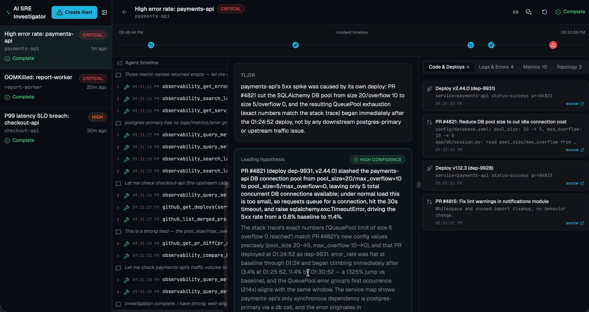

# AI SRE Investigator



An AI teammate that ingests a production alert, runs a real agentic investigation across GitHub
and observability data, and surfaces a cited root-cause hypothesis with actionable next steps —
in a UI built to be open during an actual incident, not a chatbot bolted onto one.

[EVALS.md](EVALS.md) covers the eval framework in depth. This file is the practitioner's
summary.

## What it does

1. **An alert arrives** — a one-click scenario preset, a custom alert, or a real webhook POST.
2. **The system investigates** — a two-phase agent run: freeform evidence-gathering with live
   tool calls, then a schema-validated synthesis call.
3. **The UI shows the work as it happens** — a live agent timeline, a time-scaled incident
   strip (deploys/PRs/errors/the alert itself on one visual axis), and a verdict panel with
   ranked hypotheses, confidence, and click-to-highlight evidence citations.
4. **You can push back** — ask a follow-up question against the evidence already gathered,
   record whether a hypothesis was actually right, copy a Slack-ready summary, or preview
   (never execute) a suggested mitigation command.

## Quickstart

```bash
make install   # backend venv + pip install, frontend pnpm install
make dev       # backend on :8000, frontend on :5173
```

Open http://localhost:5173, click **Create Alert**, pick a scenario preset. That's it — no API
keys, no accounts, no database.

**Requirements:** Python 3.11+, Node 20+, `pnpm`, and the `claude` CLI installed and logged in
(`claude` on `PATH`; run `claude` once interactively if you haven't authenticated). This is the
only credential the app needs — see [Why the `claude` CLI, not the SDK](#why-the-claude-cli-not-the-sdk).

**Optional — real observability data instead of the mock fixture:** set
`OBSERVABILITY_DATA_SOURCE=live` plus the `PROMETHEUS_URL`/`LOKI_URL`/`GLITCHTIP_*` vars in the
root `.env` (see `.env.example`) and stand up `observability-stack/` per
[its README](observability-stack/README.md). GitHub evidence stays mocked either way. Also
optional: set `ANTHROPIC_API_KEY` in `.env` to run the CLI in `--bare` mode instead of relying on
an interactive `claude login` session — implemented and unit-tested, but not live-verified
against a real key.

## The four demo scenarios

Each is a hand-authored fixture with a genuine causal chain **and a deliberate decoy**, so the
demo actually tests reasoning, not pattern-matching:

| Scenario                  | Root cause                                                                         | The decoy                                                                           |
| ------------------------- | ---------------------------------------------------------------------------------- | ----------------------------------------------------------------------------------- |
| **Bad deploy**            | A PR shrinks a DB connection pool 4x; deploy 6 min before the spike exhausts it.   | An unrelated lint-only deploy in the same window.                                   |
| **Downstream dependency** | A synchronous upstream service degrades; the alerting service's own code is clean. | A real, recently-merged, _flagged_ copy-only PR — tempting, irrelevant.             |
| **Slow resource leak**    | An unbounded in-process cache, merged **21 hours** before the alert.               | A real hotfix deployed 9 minutes before the alert — "blame the latest deploy" bait. |
| **Config/flag flip**      | An ops-console feature-flag rollout, zero deploys involved.                        | A merged-but-not-yet-deployed fix PR sitting in the timeline.                       |

The second scenario is the one worth watching closely: the agent has to actively rule out its
_own_ alerting service before pointing at a dependency it doesn't own.

## Architecture

```
  React + Vite + Tailwind          IndexedDB (client-side history,
  ┌─────────────────────┐          survives a backend restart —
  │ Inbox | Investigation│◄──SSE── there's no database, see below)
  └──────────┬───────────┘
             │ REST + SSE
  ┌──────────▼───────────┐
  │       FastAPI          │
  │  POST /api/alerts       (webhook + button, identical path)
  │  GET  .../stream         (SSE)
  │  POST .../ask            (follow-up Q&A, resumes the same session)
  │  POST .../feedback       (👍/👎 + actual root cause)
  │                        │
  │  Orchestrator          │
  │   ├─ Triage    keyword classification → playbook hint + window
  │   ├─ Phase A   `claude` CLI, stream-json, freeform tool use
  │   ├─ Correlate deterministic time/path scoring (pure functions)
  │   └─ Phase B   `claude --resume`, --json-schema, validated output
  └──────────┬───────────┘
             │ stdio MCP
  ┌──────────▼───────────┐
  │  Local MCP tool server │
  │  11 read-only tools: github_*, observability_*
  │  ├─ GitHub: mock       │  Live adapter deferred (Phase 7a)
  │  └─ Observability:     │  Mock by default; OBSERVABILITY_DATA_SOURCE=live
  │     mock or live       │  points at a real self-hosted Prometheus/Loki/
  │                        │  GlitchTip stack — see observability-stack/
  └───────────────────────┘
```

### Why the `claude` CLI, not the SDK

The CLI won on two things the SDK doesn't give you for free: **MCP
tool-calling with zero glue code** (`--mcp-config` + `--strict-mcp-config`, no hand-rolled tool
loop), and **schema-validated structured output** (`--json-schema`, no manual JSON
parse-and-repair loop). Both mattered more than the SDK's connection pooling and retry logic for
a prototype at this scope — see "Future improvement" below for the production trade-off.

One real finding from building on it: `--strict-mcp-config` genuinely limits the agent to only
the MCP server you hand it, and `--disallowedTools` genuinely removes built-in tools from the
model's tool set entirely (verified: a disallowed `Bash` tool doesn't exist to the model at all,
confirmed by attempting a real file write that didn't happen) — this agent is read-only by
construction, not by prompt convention.

### The two-phase design, and why

**Phase A** (evidence gathering) runs freeform — the agent calls tools, no schema constraint —
because forcing structure too early would cap what it can investigate. **Phase B** (synthesis)
resumes the _same CLI session_ with a JSON Schema whose `evidence_ids` enum is built from the
evidence Phase A actually produced. The consequence: **a hallucinated citation is a schema
violation, not just bad output** — the model structurally cannot cite evidence that doesn't
exist. This is re-validated again defensively in `_apply_synthesis`, but the schema constraint
is what makes it true by construction rather than by hope.

Every evidence item shown in the UI is deterministically mapped from a real tool-call result
(`evidence_mapper.py`) — the model never authors evidence content, only cites IDs from records
that already exist. Ranking is a hybrid: a pure, unit-tested correlation scorer
(`correlate.py`) computes time/path relevance independent of the model's own narrative, and
flags a hypothesis whose citations don't match the strongest signal — a guardrail on the model's
reasoning that doesn't depend on the model being right about itself.

### What's mocked, and how it went live

Per the brief, both data sources started mocked. `GitHubSource`/`ObservabilitySource` are
`Protocol`s (`app/sources/base.py`), designed in Phase 1 — before any fixture existed —
specifically so a real implementation could satisfy the same interface later without touching
the MCP tools, orchestrator, or UI above it. Phase 7 cashed that in for observability:
`LiveObservabilitySource` (`app/sources/observability_live.py`) queries a real self-hosted
Prometheus + Loki + GlitchTip stack, selected independently of GitHub via
`OBSERVABILITY_DATA_SOURCE=mock|live` (GitHub keeps its own `DATA_SOURCE` switch, still mock-only
— the live GitHub adapter is Phase 7a, deferred by choice). The `observability-stack/` directory
has everything needed to stand the real stack up locally, including a toy service that
deliberately reproduces the `bad-deploy` scenario's regression with real metrics/logs/errors
instead of a fixture — see [its README](observability-stack/README.md) for how to stand it up,
including the concurrency bugs found while building it and the live end-to-end verification.

## Project structure

```
backend/
  app/
    api/routes.py            All HTTP + SSE endpoints
    orchestrator/            Triage, playbooks, the CLI adapter, the two-phase runner,
                              evidence mapping, correlation scoring
    sources/                 GitHubSource/ObservabilitySource protocols, mock impls,
                              and observability_live.py (real Prometheus/Loki/GlitchTip)
    fixtures/scenarios/      The 4 hand-authored scenarios (the eval cases, too — see EVALS.md)
    mcp_server/              The stdio MCP tool server the agent actually talks to
    models/domain.py         Pydantic models — the single source of truth for the API contract
  evals/                     make eval: LLM-judge + deterministic scoring, see EVALS.md
  tests/                     65 fast tests (no API cost) + 3 live tests (real CLI, opt-in)
frontend/
  src/
    components/              Inbox, Create Alert, the 3-region investigation view,
                              incident timeline strip, feedback/follow-up/share UI
    hooks/                   SSE-driven investigation state, inbox list + light polling
    lib/                     Typed API client (generated from the backend's OpenAPI schema),
                              IndexedDB persistence, formatting
observability-stack/         Optional: real Prometheus/Loki/GlitchTip + a toy demo service,
                              for OBSERVABILITY_DATA_SOURCE=live (see its own README)
```

## Commands

```bash
make dev          # both processes, hot-reloading
make test         # 65 fast backend tests, no API cost
make test-live    # 3 tests against the real claude CLI (~$0.30-0.50, ~90s)
make eval         # full eval harness against all 4 scenarios (~$1.35, runs concurrently) — see EVALS.md
make types        # regenerate frontend TS types from the backend's OpenAPI schema
make tools-demo   # print every mock tool's output for every scenario — a fixture sanity check
make lint         # ruff + mypy --strict (backend), oxlint (frontend)
```

## Known limitations

This is a prototype, and some gaps are deliberate scope calls rather than oversights — each is
explained where it's made:

- **GitHub is mock-only.** Observability can run against a real self-hosted stack
  (`OBSERVABILITY_DATA_SOURCE=live`, see above); the live GitHub adapter is deferred (Phase 7a).
  No credentials of any kind are required for the default mock-only path.
- **"Replay" is re-run, not frozen-evidence replay.** Re-running fires a fresh investigation of
  the same alert rather than deterministically replaying stored evidence — a real scope
  reduction, not a silent one.
- **The eval's abstention metric has a known blind spot**, caught on its very first real run:
  it can't currently distinguish "cited a decoy to correctly rule it out" from "cited a decoy to
  blame it," because `Hypothesis.evidence_ids` doesn't separate supporting from refuting
  evidence. Documented with the actual judge output in [EVALS.md](EVALS.md), left as scoped
  future work rather than same-day-patched.
- **A handful of lower-severity items** from an explicit end-to-end review pass (a CLI
  cancellation edge case, evidence deduplication, schema-level validation on `Hypothesis.rank`)
  were left with reasoning rather than fixed under continued time pressure on
  concurrency-sensitive code.

## Future improvement

A real GitHub adapter behind the existing `Protocol` boundary (observability's live adapter is
already done, see above), alert ingress normalization for vendor-shaped webhooks, the
`evidence_ids` schema split needed to fix the abstention metric's blind spot, variant eval cases
beyond the four hand-authored scenarios, and moving the CLI subprocess to the Anthropic SDK
directly once connection pooling and token accounting matter more than zero-glue-code MCP
calling did at this scope.
